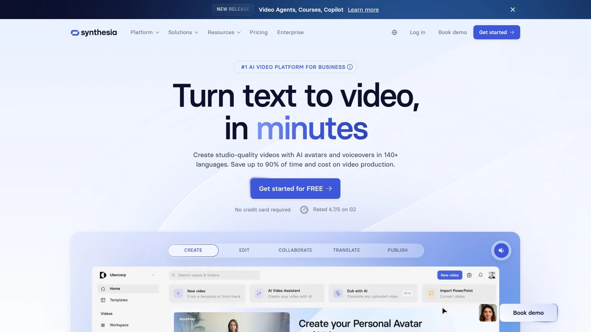
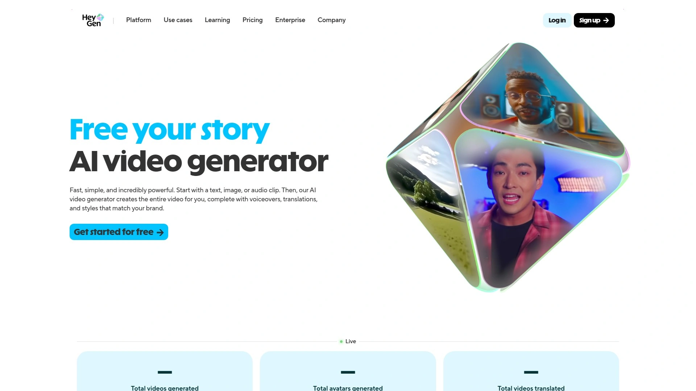
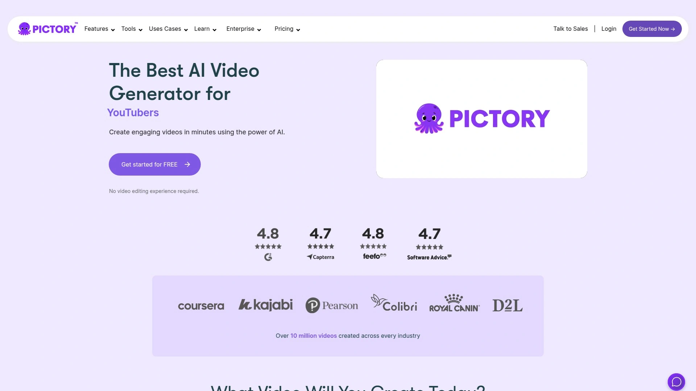
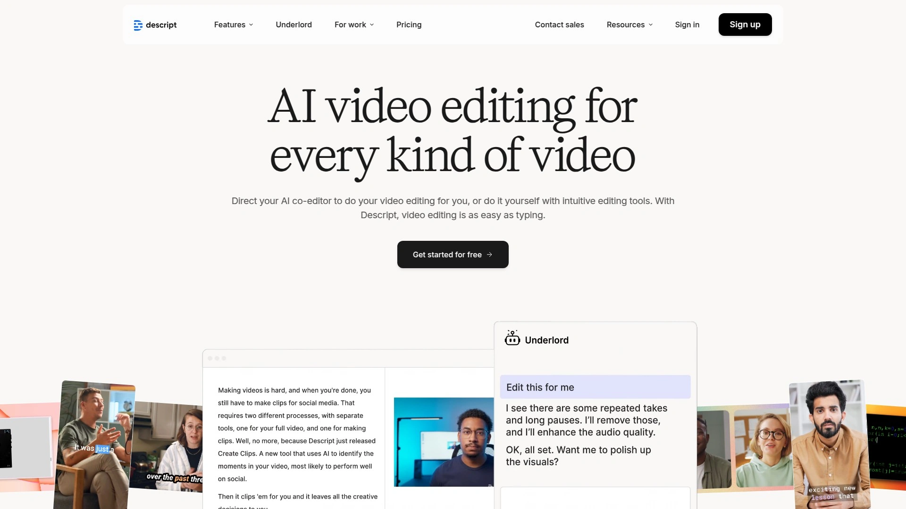
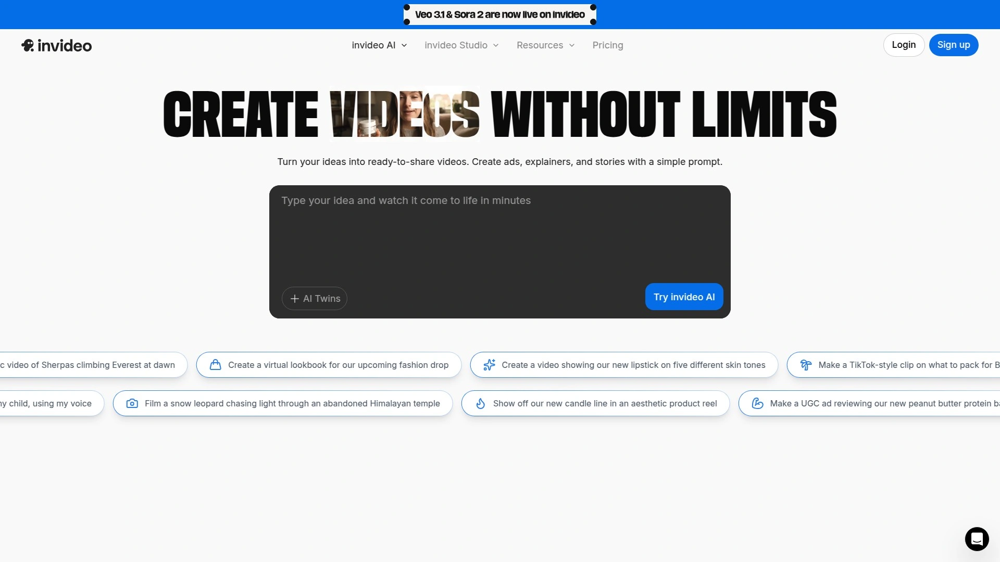
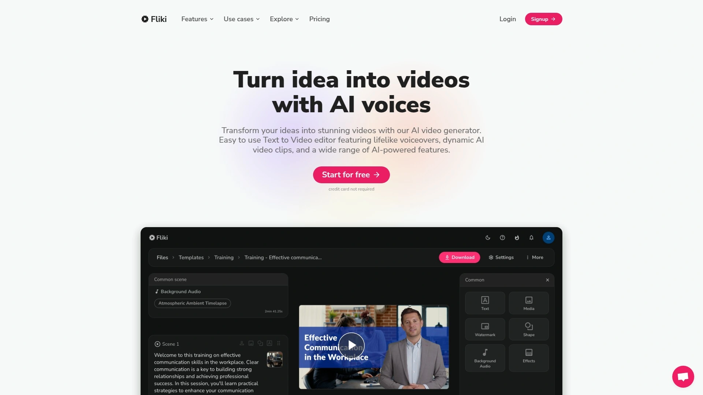
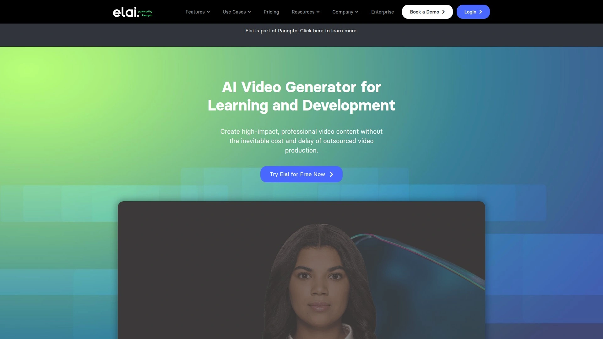
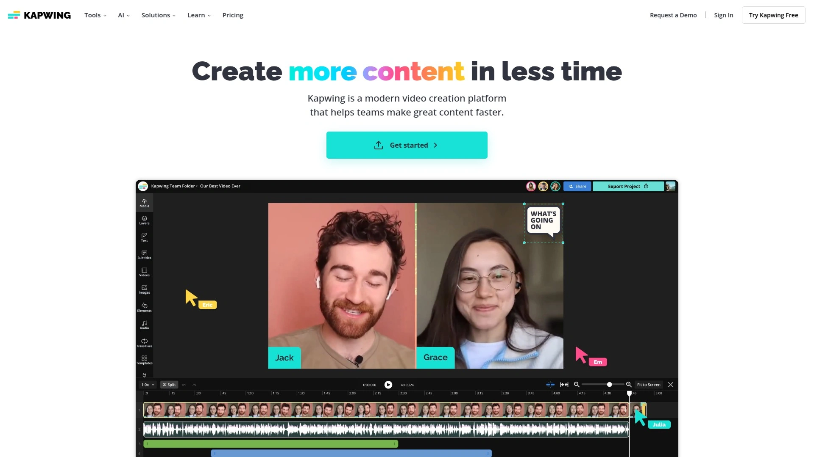
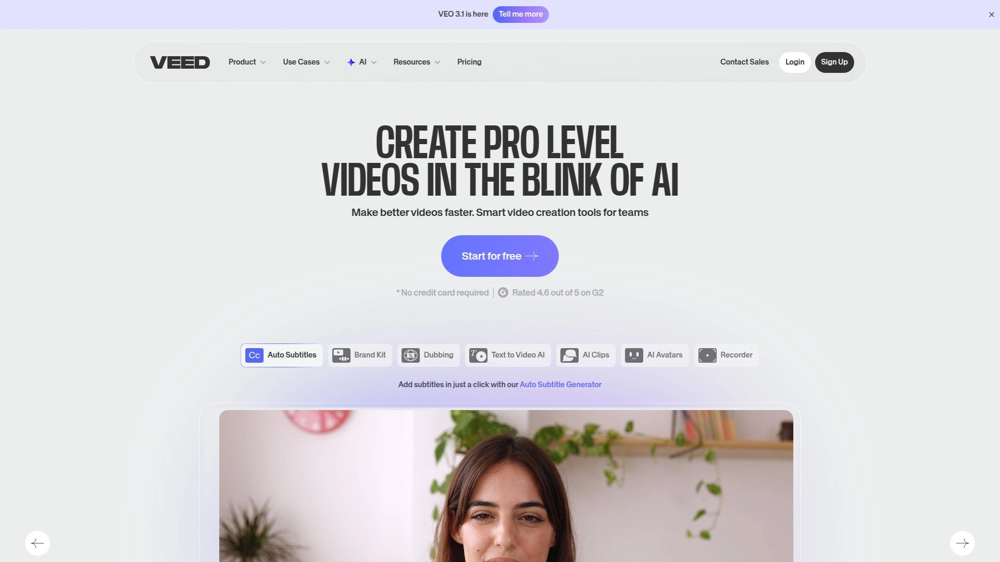
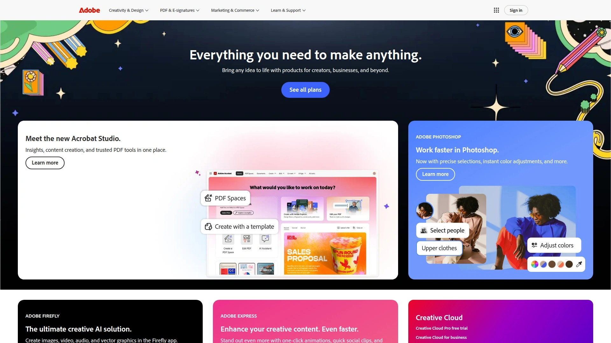

# 12 Best AI Video Generator Tools in 2025

Filming videos takes hours of setup, expensive equipment, and professional editing skills most people don't have. AI video generators eliminate these barriers by converting text scripts into polished videos complete with realistic avatars, voiceovers in 140+ languages, and professional visuals—all without stepping in front of a camera. This guide walks through twelve platforms transforming how businesses create training content, marketing materials, and social media clips, with detailed breakdowns of avatar quality, editing flexibility, and pricing structures that actually work for teams of any size.

***

## **[Synthesia](https://synthesia.io)**

Leading AI video platform with 240+ ultra-realistic avatars, one-click translation into 140+ languages, and enterprise-grade security trusted by thousands of companies worldwide.

Synthesia dominates the AI video space by making professional video production as simple as creating a PowerPoint presentation. The platform hosts over 240 diverse AI avatars based on real human models, including both pre-made expressive avatars and custom personal avatars that digitally replicate yourself. This eliminates the need for cameras, studios, or on-screen talent entirely.

The text-to-video engine accepts input from multiple sources—typed scripts, uploaded documents, PowerPoint presentations, or pasted URLs—and instantly transforms them into editable video drafts. Their AI script generator produces well-structured content from simple prompts, helping teams overcome writer's block and maintain consistent messaging. Videos export in studio quality with professional polish despite requiring zero technical skills.

Translation capabilities stand out as genuinely exceptional. One-click translation converts finished videos into any of 140+ supported languages while automatically adjusting voiceovers and lip-sync. This makes global training programs and international marketing campaigns dramatically more affordable than traditional localization methods.

Synthesia's proprietary ZoogShadowing technology generates custom AI b-roll footage directly from text prompts. Users can create cinematic-quality background scenes and industry-specific materials without sourcing stock footage. The platform includes 250+ professionally designed templates categorized by use case—training videos, sales pitches, HR updates, marketing announcements. Each template provides pre-built scenes and layouts that fully customize to match brand colors, fonts, and visual styles.

Security measures meet enterprise requirements with SOC 2 compliance, GDPR adherence, and customizable MSAs. The platform integrates smoothly with existing workflows through APIs and supports collaboration features for team-based production. Pricing starts with a free plan offering three minutes monthly, nine stock avatars, and full language support. Premium tiers unlock the complete avatar library, unlimited video generation, and advanced customization options.

***

## **[HeyGen](https://www.heygen.com)**

Next-generation avatar creator featuring Avatar IV technology that transforms single photos into full videos with natural hand gestures and expressive face dynamics.

HeyGen pushes avatar realism to new heights with technology that makes AI-generated presenters nearly indistinguishable from real humans. Their Avatar IV model represents their most advanced system yet, converting a single image into complete video with synchronized voice, natural facial expressions, and authentic hand gestures. This photo-to-video capability lets anyone create a digital spokesperson without filming.

The platform offers multiple avatar creation methods. Video avatars let you film yourself once to generate a lifelike digital twin that looks and sounds exactly like you, eliminating the need to be on camera ever again. Photo avatars generate unlimited AI versions of yourself from a single image and text instructions. The stock avatar library contains over 1,000 pre-made options tailored for different situations and demographics.

Text-to-video functionality automates the entire production process. Simply paste a script, and HeyGen generates high-quality videos in 1080p or 4K resolution complete with voiceover, visuals, and avatar presentation. Voice-to-avatar animation allows recording your own voice or using text-to-speech with their AI voices. The platform supports 100+ languages with instant video translation that transforms content for global audiences.

Instant Highlights automatically converts long-form video links into engaging short clips, perfect for social media repurposing. Customization options let you adjust avatar appearance, voice, expressions, clothing, backgrounds, and movements to match any brand style. The interface requires no technical skills—videos generate with just a few taps on mobile devices.

Use cases span social media content, marketing videos, educational materials, virtual events, sales pitches, and onboarding videos. Teams particularly value HeyGen for creating user-generated content-style videos and product testimonials without hiring actors or managing complex logistics. The platform saves massive amounts of production time while delivering professional results that engage audiences.

***

## **[Pictory](https://pictory.ai)**

Content repurposing specialist that transforms blog posts, articles, and long videos into engaging short-form content optimized for social media distribution.

Pictory excels at converting existing written content into video format automatically. The script-to-video feature lets users paste text into the editor, and Pictory's AI matches it to relevant video clips and images to generate a complete video. This proves especially popular for creating explainer videos, listicles, and educational content.

Blog-to-video functionality analyzes URLs of published articles and automatically summarizes them into key points. The platform pulls out essential sentences and paragraphs, essentially creating a "CliffsNotes version" of the full article. It then matches the condensed content to visuals, producing shareable videos that drive traffic back to the original post.

The edit-videos-using-text feature handles existing video content uniquely. Upload a video, and Pictory automatically transcribes it. You can then edit the text transcript to alter the video itself—delete sentences from the transcript, and those sections disappear from the video. This makes creating concise highlight reels ranging from 30 seconds to 10 minutes incredibly simple.

Pictory's strength lies in repurposing long-form content for multiple platforms. A single blog post becomes an Instagram Reel, YouTube Short, TikTok video, and LinkedIn post in minutes. Marketing teams use this to maximize the ROI of every piece of content they create.

The platform includes a vast library of stock footage, images, and audio clips to enhance videos. AI-powered scene selection chooses visuals that actually match your content rather than random stock footage. Automatic captioning adds subtitles in multiple styles, improving accessibility and engagement. Pricing remains competitive with free trials and affordable monthly plans that suit solopreneurs and agencies alike.

---

## **[Descript](https://www.descript.com)**

Revolutionary text-based video editor combining transcription-driven editing, podcast production, screen recording, and AI assistant Underlord for automated tasks.

Descript reimagines video editing by making it work exactly like editing a document. The platform transcribes uploaded video footage automatically, then lets you edit the video by modifying the transcript. Delete words from the text, and those sections disappear from the video. This eliminates the learning curve of traditional timeline-based editors.

Underlord, Descript's AI assistant, handles complex editing tasks through simple text prompts. Ask it to "repurpose this video into a 15-second TikTok using the most engaging parts," and it automatically identifies highlights, trims footage, and adds captions. Request chapter markers, and Underlord splits your video into digestible sections. The AI can even suggest missing topics that would improve your content.

Multitrack editing allows layering audio, video, and graphics separately. Video podcasters can have audio as one track and video as another, editing them independently. Add B-roll footage on top of original video to keep visuals engaging without complex timeline manipulation.

AI-powered features accelerate production significantly. Filler word removal automatically detects and cuts "um," "uh," "like," and similar hesitations. Studio Sound improves audio quality with one click, making amateur recordings sound professional. Eye contact correction adjusts your gaze to look directly at the camera even when you were reading notes. Overdub generates AI voices that can replace or add narration in your own voice.

Screen recording functionality captures your desktop with optional webcam overlay, perfect for tutorials and software demonstrations. Automatic transcription supports 23 languages, and videos can be translated into multiple languages. Real-time collaboration lets teams work on projects simultaneously like Google Docs. Descript serves podcasters, YouTubers, marketers, educators, and anyone who creates video content regularly.

***

## **[InVideo AI](https://invideo.io)**

OpenAI-powered video production platform featuring voice cloning, multilingual dubbing in 50+ languages, and animation-style video generation with version 3.0 models.

InVideo AI leverages OpenAI's GPT-4.1, image generation API, and text-to-speech models to function as a complete video production team. Users direct their vision through natural language prompts while AI agents handle scripting, media selection, voiceovers, and editing. The platform generates professional-quality videos in minutes rather than hours or days.

Version 3.0 introduces animation-style video creation and advanced customization features. Voice cloning technology replicates your voice accurately, allowing you to narrate videos in your tone across multiple projects. Multilingual dubbing translates and localizes content into over 50 languages automatically. This proves invaluable for creators targeting international audiences.

AI avatars create training videos, onboarding walkthroughs, and product explainers without filming. Express avatars generate your AI twin from recorded video or YouTube links. These digital clones handle content delivery with consistent quality while you skip studios, delays, and coordination hassles.

UGC video creation produces ultra-realistic testimonials, spokesperson clips, selfie-style content, and product reviews using diverse human avatars. This eliminates the need to hire freelancers, send products for review, or manage endless revision cycles. Virtual product try-ons let shoppers see bags, outfits, and accessories in action on AI-generated models.

The platform supports workflows for explainer videos, promos, ads, stories, and full-length AI films in 80+ languages. Edit videos through simple text commands rather than complex timeline manipulation. Change scenes, swap music, refine tone, and adjust voiceovers conversationally. InVideo AI works across devices with mobile apps that make video creation accessible anywhere.

***

## **[Fliki](https://fliki.ai)**

Text-to-video specialist offering 2,000+ lifelike AI voices across 80+ languages, voice cloning capabilities, and script-to-scene intelligence for consistent visual storytelling.

Fliki transforms text into polished videos through a four-step process that requires zero editing experience. Input your text, script, blog article, or any textual content. Choose from over 2,000 human-like AI voices available in 80+ languages and dialects. The AI automatically selects appropriate visuals from millions of premium stock assets, or you can customize media choices. Preview and export in MP4 or MOV formats optimized for all major platforms.

Voice cloning technology replicates your voice with high accuracy from a short sample. This creates a custom voice model ideal for personal branding, training content, and multilingual localization while maintaining consistent vocal identity. The platform supports videos for YouTube, Instagram Reels, TikTok, training programs, and marketing campaigns.

AI avatars act as on-screen presenters with synchronized lip-sync and customizable positioning. These avatars work perfectly for explainer videos, tutorials, and personal branding without requiring camera time. Character consistency features maintain visual continuity across scenes, crucial for professional-looking productions.

Script-to-scene intelligence analyzes your text and automatically matches appropriate visuals, transitions, and pacing. This eliminates hours of manual media hunting and scene arrangement. The platform generates captions automatically in multiple styles, enhancing accessibility and viewer retention.

Fliki excels at creating scroll-stopping content for social media. Viral shorts, professional explainers, and educational content all generate quickly with templates optimized for different platforms. Videos export in various aspect ratios including 1:1, 16:9, and 9:16 to match platform requirements. The 15,000-character text limit accommodates substantial scripts for longer-form content.

***

## **[Runway ML](https://runwayml.com)**

Cutting-edge AI video generator specializing in text-to-video, image-to-video, and video-to-video transformations with cinematic quality and advanced motion controls.

Runway ML leads in generative AI video creation with their Gen-4 and Gen-3.5 Turbo models. Gen-4 delivers ultra-realism with detailed physics simulation, cinematic motion, and natural parallax effects perfect for high-end advertisements and film pre-visualization. Gen-3.5 Turbo prioritizes speed for quick social content and creative sketches while maintaining stylized realism.

Text-to-video functionality generates high-quality videos directly from descriptions. Enter a prompt, and Runway creates engaging visuals with appropriate camera movements, lighting, and scene composition. Image-to-video transforms static images into dynamic animated videos with AI-powered motion effects. This breathes life into photographs, illustrations, and graphics.

Video-to-video capabilities enhance and transform existing footage with AI. Add new styles, improve effects, adjust motion, and upgrade visual quality without manual frame-by-frame editing. End frame control allows precise locking of final frames for seamless loops and transitions.

Camera motion controls enable dynamic cinematic movements. Gen-4 handles complex camera work including tracking shots, crane movements, and smooth parallax. This professional-grade control elevates content beyond what simpler generators produce.

Runway serves filmmakers, advertisers, content creators, and visual effects artists. The platform supports both quick social media clips and complex pre-production visualization for major projects. Free tiers allow experimentation with limited generation time, while paid plans unlock extended capabilities and faster processing. Runway's focus on artistic quality and technical control makes it the choice for creators prioritizing visual excellence.

***

## **[Elai.io](https://elai.io)**

Avatar-focused platform with four distinct avatar types—Selfie, Studio, Photo, and Animated Mascot—plus voice cloning in 28 languages for corporate training and education.

Elai.io specializes in avatar-led videos for learning and development. The platform offers 80+ high-quality pre-made avatars and four custom avatar types. Selfie avatars capture your likeness through simple mobile recording. Studio avatars provide professional presentation quality. Photo avatars generate talking videos from a single facial image. Animated mascots add playful brand characters to educational content.

Voice cloning technology replicates your voice across 28 languages. This enables creating training content in multiple languages while maintaining your vocal identity. The platform supports 75+ languages and 450+ accents total, ensuring global reach.

Text-to-video conversion transforms written documents into visually engaging presentations without filming equipment or actors. Upload PowerPoint slides, PDFs, or documents, and Elai generates video content automatically. This revolutionizes corporate training by making video production accessible to subject matter experts rather than requiring specialized production teams.

Interactive features include quizzes and scenario-based learning modules embedded directly in videos. This transforms passive viewing into active learning experiences that improve knowledge retention. Videos can be shared across learning management systems with tracking for engagement and completion.

Translation capabilities convert finished videos into 80+ languages with a few clicks. Multi-lingual video variants allow viewers to select their preferred language, particularly valuable for enterprise-wide training programs. The platform generates videos in seconds with realistic narration, eliminating weeks of traditional production time. Pricing remains competitive with annual plans around €440 for full features including custom avatars and voice cloning.

***

## **[Colossyan](https://www.colossyan.com)**

Training-focused AI video platform converting documents and presentations into avatar-narrated content with built-in quizzes and 80+ language support.

Colossyan transforms text, documents, presentations, and screen recordings into avatar-narrated training videos automatically. The platform specifically targets corporate learning, onboarding, and internal communications. Upload a PowerPoint, PDF, or document, and Colossyan generates video content complete with AI avatars, scripts, and visuals.

The five-step creation process streamlines production. Start a new draft or upload existing materials. Paste and edit your script in the editor. Select relevant AI voices and avatars from the library. Design scenes and add animations or media where needed. Preview, generate, and export your finished video.

Over 600 voiceovers support diverse languages and accents. Voice cloning capabilities let you replicate team members' voices for consistent brand identity across localized content. Pronunciation customization ensures accurate on-brand speech when scaling to new markets.

Interactive video features distinguish Colossyan from basic video generators. Embed quizzes directly in videos to test comprehension. Create immersive scenario-based training where learners make decisions that affect the story. These engagement tools improve learning outcomes compared to passive video watching.

Learning Management System integrations include ClickLearn and 360Learning, enabling managers to track progress and engagement. Additional integrations support YouTube, PowerPoint, and VideoAsk. Security features meet enterprise requirements with SOC 2 compliance, SAML SSO, and customizable agreements.

Template library includes pre-designed videos for sexual harassment policy, cybersecurity training, and employee onboarding. These accelerate production for common corporate training scenarios. Colossyan reduces video creation costs and time dramatically through automation while promoting sustainability by eliminating physical sets and travel.

***

## **[Lumen5](https://lumen5.com)**

Social media optimization specialist that transforms blog posts into short videos with drag-and-drop editing and extensive media libraries for brand-consistent content.

Lumen5 simplifies video creation for marketing and communications teams who lack video editing experience. The platform converts written content—ideas, blog posts, articles—into engaging visual stories automatically. This addresses the challenge of producing high-quality video content quickly without specialized skills or resources.

AI content creation analyzes text and selects appropriate visuals, transitions, and pacing. Branded templates maintain consistency across all videos, ensuring every piece aligns with brand guidelines. Custom template creation allows teams to build reusable formats for different content types.

Drag-and-drop interface makes editing intuitive for users of all skill levels. Rearrange scenes, swap media, adjust timing, and customize text without learning complex software. The platform includes extensive libraries of stock images, video clips, and audio tracks to enhance productions.

Lumen5 particularly excels at social media content. Videos automatically resize for different platforms—square for Instagram, vertical for TikTok, horizontal for YouTube. This repurposing capability maximizes content ROI by adapting one video for multiple distribution channels.

Blog-to-video conversion proves especially valuable for content marketers. Paste a blog URL, and Lumen5 generates a video summary that drives traffic back to the original article. This extends content lifespan and reaches audiences who prefer video over written content.

The Creative Services Team provides professional assistance for teams with specific brand requirements. This optional support ensures complex branding needs are met while maintaining the platform's speed advantages. Lumen5 reduces video production time from weeks to hours while maintaining professional quality.

***

## **[Kapwing](https://www.kapwing.com)**

Collaborative AI video editor featuring Smart Cut, Magic Captions, and real-time team editing with Google Docs-style collaboration for fast content creation.

Kapwing positions itself as an all-in-one video creation and editing platform requiring zero downloads or installations. The browser-based tool works on any device, making video editing accessible regardless of hardware limitations.

Smart Cut automatically detects and removes silent sections of videos, dramatically reducing editing time. This AI feature focuses your attention on important content rather than tedious trimming. Magic Captions generates accurate transcriptions and offers various caption styles and animations. These animated captions significantly boost social media engagement.

Trim with Transcript revolutionizes video editing by allowing changes directly to the automatically generated text. Edit the transcript like a document, and video cuts match your text edits. This eliminates traditional timeline confusion for beginners.

AI-generated videos create content from text prompts. Describe your concept, and Kapwing generates videos with B-roll footage, music, and subtitles automatically. Canvas resizing repurposes content for different platforms—TikTok, YouTube, Instagram—with one click. Background removal isolates people without green screens, enabling professional compositing.

Real-time collaboration mirrors Google Docs functionality. Teams edit and review projects simultaneously with changes visible to everyone instantly. This eliminates version control nightmares and accelerates approval processes.

AI tools include script generators, audio cleaners, video quality enhancers, and waveform creators for podcast content. The platform maintains brand consistency through shared asset libraries and custom templates. Kapwing serves marketers, educators, content creators, and social media managers who need to produce high-quality videos quickly.

***

## **[VEED.io](https://www.veed.io)**

Accessible AI video platform with auto-subtitles, one-click translations, and extensive editing tools optimized for creating social media content at scale.

VEED.io delivers professional video editing through an intuitive browser-based interface. The text-to-video AI builds complete videos from simple descriptions or pre-written scripts. Select one of their prompts or describe your needs, and VEED constructs everything automatically including visuals, transitions, and audio.

Auto-subtitle generation creates captions in multiple languages with customizable styles. Subtitles dramatically improve engagement on social platforms where videos often play muted. One-click translation converts videos into different languages, expanding audience reach globally.

Video templates accelerate production for common content types. Social media formats, marketing videos, tutorials, and presentations all have pre-built templates that customize to your brand. The platform includes stock media libraries with millions of video clips, images, and audio tracks.

Screen recording captures desktop activity with optional webcam overlay for tutorials and demonstrations. Video compression optimizes file sizes for faster uploading and sharing. Background removal works automatically without green screens. Audio editing tools clean up background noise and balance sound levels.

Collaboration features support team workflows with commenting, project sharing, and role-based permissions. Brand kits store logos, colors, and fonts for consistent styling across all projects. VEED exports videos in various formats and resolutions optimized for different platforms.

The platform particularly serves content creators, marketers, educators, and small businesses producing video content regularly. Free plans offer limited features while paid subscriptions unlock advanced capabilities and remove watermarks. VEED's strength lies in making professional video editing accessible to non-experts while maintaining quality output.

---

## **[Adobe Firefly](https://www.adobe.com)**

Enterprise-grade generative AI from Adobe designed for creating b-roll footage, special effects, and commercial-use videos with full licensing protection.

Adobe Firefly brings enterprise reliability to AI video generation. The text-to-video functionality generates high-quality video clips from text prompts specifically designed for b-roll, special effects, and supplementary footage. This proves invaluable for professional productions requiring licensed, commercially-safe content.

Firefly's distinguishing feature is its training data approach. Adobe uses only licensed content, public domain materials, and expired copyright works. This provides legal protection for commercial use that many AI generators trained on scraped internet data cannot guarantee.

Integration with Adobe Creative Cloud applications creates seamless workflows. Generate video clips in Firefly, then immediately edit them in Premiere Pro with full project compatibility. This ecosystem approach appeals to professional video editors and creative agencies already invested in Adobe tools.

The platform excels at generating specific types of footage—establishing shots, transition elements, abstract backgrounds, and visual effects. While not designed for complete video production like Synthesia or HeyGen, Firefly fills gaps in existing projects with generated content that matches professional quality standards.

Adobe's commitment to ethical AI and content licensing makes Firefly the choice for risk-averse enterprises and agencies concerned about intellectual property issues. The platform updates regularly with new capabilities as Adobe develops their generative AI technology.

---

## FAQ

**Which AI video generator creates the most realistic avatars for business presentations?**

Synthesia leads in avatar realism with 240+ diverse avatars based on real human models, offering both expressive pre-made avatars and custom personal avatars that replicate yourself digitally. HeyGen's Avatar IV technology also excels by transforming single photos into full videos with natural hand gestures and facial expressions. Both platforms create avatars nearly indistinguishable from real presenters, making them ideal for professional business communications, training videos, and corporate presentations.

**Can these AI video tools translate content into multiple languages automatically?**

Synthesia offers one-click translation into 140+ languages with automatic voiceover and lip-sync adjustments. InVideo AI provides multilingual dubbing in 50+ languages. Fliki supports 80+ languages with 2,000+ AI voices. Colossyan translates into 80+ languages with multi-lingual video variants. These translation features make global content distribution dramatically more affordable than traditional localization.

**What's the easiest AI video platform for complete beginners with zero editing experience?**

Synthesia makes video creation as simple as creating PowerPoint slides, requiring zero technical skills. Descript's text-based editing lets you edit videos by modifying transcripts like a document. Lumen5 offers drag-and-drop simplicity specifically for non-editors. All three platforms eliminate traditional timeline editing complexity, making them accessible to anyone who can type and click.

***

## Conclusion

Choosing the right AI video generator depends on whether you prioritize avatar realism, multilingual capabilities, editing flexibility, or specialized features like interactive training modules. From enterprise-grade platforms with extensive language support to beginner-friendly tools requiring zero technical knowledge, these twelve options cover every use case and skill level. [Synthesia](https://synthesia.io) stands out as the ideal comprehensive solution for businesses needing professional AI video creation, combining 240+ realistic avatars, one-click translation into 140+ languages, enterprise security compliance, and intuitive editing that transforms text into studio-quality videos without cameras, studios, or technical expertise.
